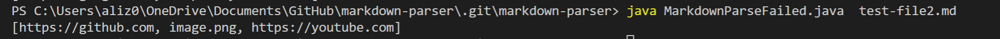
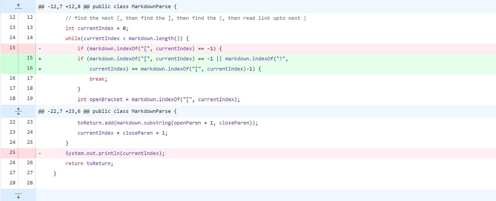
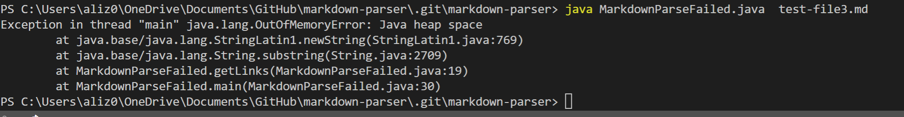
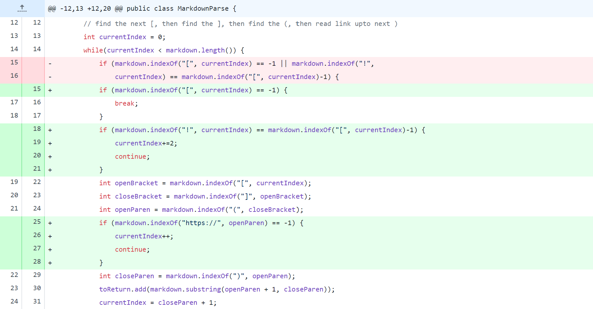
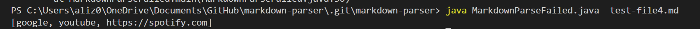
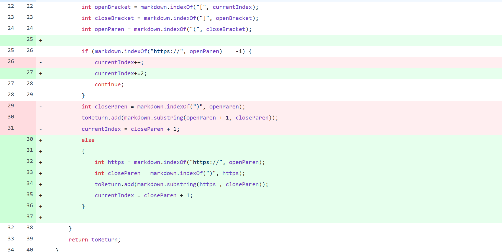

# Ali's CSE 15L Lab Report
## Debugging and Testing
---
### **Motivation**
This Blog Post is served to deal with the idea of testing and debugging. The Blog Post will deal with a particular file *MarkdownParse* as it undergoes 3 code changes to help deal with edge and logical cases.  

### **Code Change 1**
- Code change revolves around isolating images from the process of obtaining links from a markdown file.
- When tested on the base Markdown file, the following is shown:
[testFile](https://az-2003.github.io/Ali_CSE15L_LabRepo2/test-file2.md)
  
  
#### Symptoms & Explanation
- Image-links are taken into the ArrayList with other links; this is a symptom created by a logical bug where there is no sort of difference between a hyperlink syntax and that of an image-link.

#### Code Change 
- Therefore, to address the failed-output, we need to consider the syntax of the image link `````` and therefore isolate from the rest of the hyperlinks.
- Such a considertaion can be done through the code change shown:  

- By considering `!` in the method, we can handle cases where an image-link exists amongst valid hyperlinks
---
### **Code Change 2**  
- Code change revolves around dealing with incorrect syntaxes such that an `[` is not found
- When tested on the base Markdown file, the following is shown:
[testFile2](https://az-2003.github.io/Ali_CSE15L_LabRepo2/test-file3.md)
  
   

#### Symptoms & Explanation
- The absence of `[` would lead to an infinite loop as the method tries to continuously look for the next `[` that would signal the presence of another hyperlink to add. This is a functional bug caused by the edge case

#### Code Change 
- Therefore, to address the failed-ouput, we need to deal with the case where there is no `[` such that it would stop searching and end the while-loop.
- This can be done through the following code change shown:  

*Note: a minor adjustment for code change 1 was made while working on code change 2*
---
### **Code Change 3**
- Code change revolves around hyper-link validation such that the format of the hyperlink is taken into account
- When tested on the base Markdown file, the following is shown:
[testFile3](https://az-2003.github.io/Ali_CSE15L_LabRepo2/test-file4.md)



#### Symptoms & Explanation
- the program only checks for the correctness of the syntax such that it matches that of a hyperlink. However, the program provides no considertaion for the link found between the parenthesis and therefore does not check if the content inside those parenthesis is a valid link.

#### Code Change
- The program needs to find a way to consider and therefore validate the contents between the parenthesis. A prominent way to check that is by checking the presence of `https://`
- This is done through the following code change shown:

---
### **Wrap up**
This is the end of the blog post; I hope you foundit useful. **Happy Coding!**


